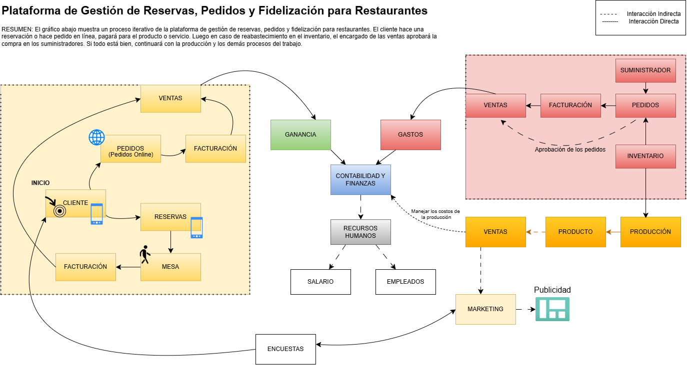

# Task Manager (Gestión de Tareas) Para Plataforma de Gestión de Reservas, Pedidos y Fidelización para Restaurantes
<video src="./vid1.mov"></video>
Este proyecto tiene finalidad de crear una plataforma SaaS (Software as a Service) Gestión de Tareas (Task Manager) para un restaurante en el cual las siguientes características son presentes: 
<ul>
  <li>Gestión de Reservas</li>
  <li>Gestión de Pedidos</li>
  <li>Fidelización</li>
</ul>

